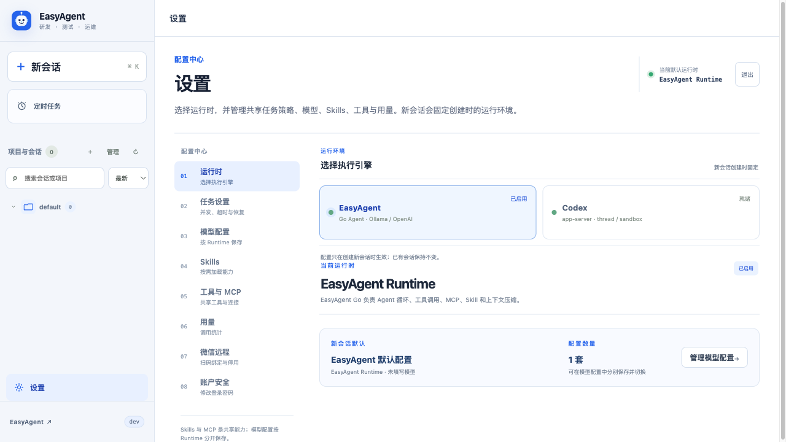
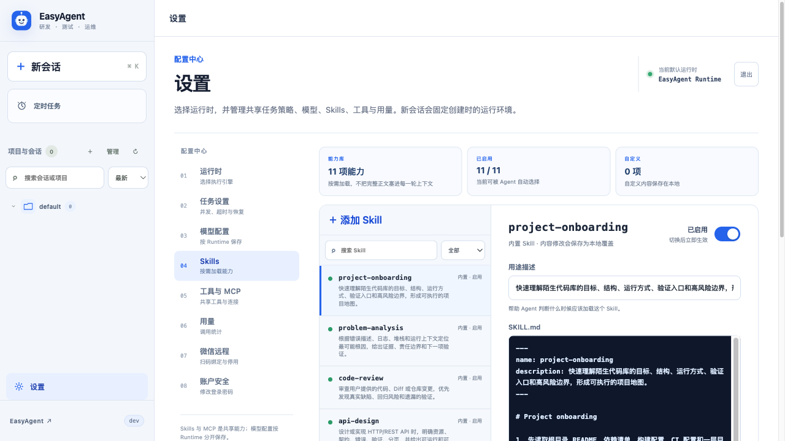

<div align="center">
  
  <h1>EasyAgent</h1>
  <p>可运行在个人电脑或 Linux 服务器上的轻量、自托管 Agent</p>
  <p><code>用户消息 → 模型 → Tool / Skill / MCP → 模型 → 最终回答</code></p>
</div>

EasyAgent 使用模型原生 Function Calling 决定是否调用工具，不引入 Graph、多 Agent
编排或工作流 DSL。它提供两种执行引擎：内置 Go Agent，以及通过
`codex app-server` 接入的 Codex Runtime。

## 主要能力

- 多轮对话、流式回答、会话搜索、排队暂停/继续与运行中中断。
- 支持 OpenAI、Ollama 及 OpenAI-compatible 模型服务。
- EasyAgent Runtime 支持图片、UTF-8 文本/代码和 PDF 附件。
- 内置文件、Shell、网页、时间、天气和计算工具，并可扩展 Skill 与 MCP。
- Agent Trace 展示模型与工具调用、Token、缓存、耗时和错误。
- 两种 Runtime 共用任务设置：默认并发 4、整轮上限 12 小时；Git 项目按会话创建 worktree，其他目录自动互斥。
- 任务队列持久化，Trace 通过 SSE 实时推送并支持断线续传。
- 长会话自动生成上下文检查点；原始消息完整保存在 SQLite。
- 单管理员登录，模型配置和会话数据均在本机保存。

## 界面预览

<p align="center">
  
</p>

<table>
  <tr>
    <td align="center" width="50%">
      <strong>Runtime 与模型配置</strong><br />
      
    </td>
    <td align="center" width="50%">
      <strong>Skills 管理</strong><br />
      
    </td>
  </tr>
</table>

## 快速开始

从 [Releases](https://github.com/lakernote/easy-agent/releases) 下载并解压对应平台的
压缩包。Linux 和 macOS 进入解压目录后运行：

```bash
./easyagent
```

Linux AMD64 也可以进入准备安装 EasyAgent 的目录，然后直接复制下面的命令。
它会把 `v0.0.1` 解压到当前目录并在后台启动：

```bash
(
set -euo pipefail
curl -fL https://github.com/lakernote/easy-agent/releases/download/v0.0.1/easyagent_0.0.1_linux_amd64.tar.gz \
  | tar -xz --strip-components=1
nohup ./easyagent >easyagent.log 2>&1 </dev/null &
printf '%s\n' "$!" >easyagent.pid
)
```

发布包已经包含可执行权限，无需再运行 `chmod +x`；如果二进制经过其他工具复制后
丢失权限，再手动赋权即可。使用 `tail -f easyagent.log` 查看日志；需要停止时执行
`kill "$(cat easyagent.pid)"`。

Windows 运行 `easyagent.exe`。服务默认监听 `0.0.0.0:8080`，启动后打开
<http://127.0.0.1:8080>；远程访问时改为服务器 IP。

首次登录用户名和密码均为 `admin`。登录后请立即在
**设置 → 账户安全** 修改密码，再到 **设置 → 模型配置** 配置模型。

> 默认监听所有网卡。公网部署必须使用 TLS 反向代理，并通过防火墙或 VPN 限制
> 访问来源。发布包目前没有 macOS/Windows 代码签名，系统可能提示未知开发者。

### 从源码构建

```bash
git clone https://github.com/lakernote/easy-agent.git
cd easy-agent
make build
./bin/easyagent
```

`make build` 会构建前端并将其嵌入 Go 二进制。启动参数：

```bash
./easyagent -listen 0.0.0.0:8080 -db /var/lib/easyagent/easyagent.db
```

不传参数时，数据库位于 `~/.easyagent/easyagent.db`，默认工作区位于
`~/.easyagent/workspaces/default`。新建会话时可以选择服务器上已有的其他目录；
会话创建后会固定 Runtime、模型配置和工作区。

发布包本身不依赖 Go、Node.js、Python、Git 或系统 SQLite。只有 Shell、stdio MCP
或任务本身需要调用这些程序时，才需要在服务器上安装。

### Codex Runtime

Codex Runtime 需要服务器安装 Codex CLI；`app-server` 是 CLI 自带的子命令，
无需单独安装，也不需要 ChatGPT Desktop：

```bash
curl -fsSL https://chatgpt.com/codex/install.sh | sh
codex --version
codex app-server --help
```

也可以在 **设置 → 运行时** 中检测或安装 Codex CLI，再到 **模型配置** 保存
Provider、Base URL、模型、推理强度和 API Key。`env_key` 应填写环境变量名（例如
`GROQ_API_KEY`），不能填写密钥本身。

Codex 的 thread、原生工具、沙箱和上下文由 app-server 管理；EasyAgent 页面维护的
Skill 与 MCP 会转换为 Codex 的标准 Skill 输入和 `mcp_servers` 配置，因此两种 Runtime
可以共用团队能力。Codex Runtime 支持 thread 继续、列表、只读详情和分支；当前只转发
文本消息，不处理页面附件。

> EasyAgent 以 `approvalPolicy=never` 和 `dangerFullAccess` 启动 Codex 任务。
> Codex 因此拥有 EasyAgent 服务账号可用的文件和命令权限。请使用低权限系统账号，
> 并仅选择可信工作区。

## 扩展方式

| 类型 | 用途 | 加载方式 |
| --- | --- | --- |
| Tool | 文件、Shell、搜索等确定性操作 | 核心工具常驻，其余按需加载 |
| Skill | 任务方法、团队规范和领域经验 | 页面管理，模型按需读取 |
| MCP | GitHub、浏览器、数据库等外部能力 | 页面配置、验证并启用 |

内置 MCP 预设包括 OpenAI Docs、Context7、Playwright 和 GitHub；Context7 使用官方远端
Endpoint，无需本地安装，API Key 可选。内置 Skill 可在页面启停、编辑或恢复默认内容。

## 发布版本

进入 **GitHub Actions → Release → Run workflow**，选择分支并输入尚未存在的版本号，
例如 `v2.0.1`。Action 会自动创建 tag 和 Release，并生成 Windows、macOS、Linux 的
amd64/arm64 压缩包与 `checksums.txt`。带 `-rc.1`、`-beta.1` 等后缀的版本会标记为
预发布。

运行 `easyagent -version` 可以查看二进制内写入的版本和提交。

## 文档

- [设计说明](docs/design.md)
- [Agent Runtime 与 Trace](docs/agent-runtime.md)
- [工程复盘与 Review 清单](docs/engineering-notes.md)
- [安全说明](SECURITY.md)
- [参与贡献](CONTRIBUTING.md)

## 当前边界

EasyAgent 是单机、单进程、SQLite 应用，只提供一个共享管理员账号，没有 RBAC、
多租户隔离或分布式任务队列。服务退出时会清理其管理的 Codex/MCP 子进程；尚未开始的
排队任务会在重启后继续，手动暂停的任务保持暂停；已经运行的任务会标记为中断，避免
自动重放命令或文件副作用。

## 许可证

[MIT](LICENSE)
