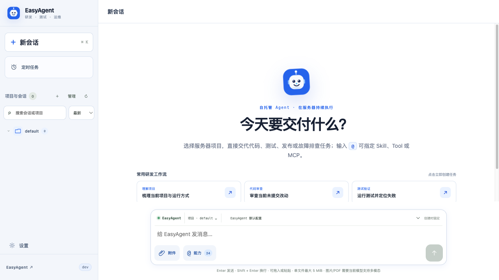

<div align="center">
  
  <h1>EasyAgent</h1>
  <p>把 AI Agent 部署到自己的电脑或 Linux 服务器，通过浏览器随时使用。</p>
  <p><strong>单个 Go 二进制 · Web UI · 双 Runtime · Tools / Skills / MCP · 实时 Trace</strong></p>
</div>

## 解决什么问题

- **远程运行 Agent**：不依赖桌面 App，把任务放到长期在线的服务器执行。
- **团队共享使用**：团队成员通过同一个 Web 页面，共享模型、Skills、MCP 和服务器工作区。
- **长任务更可靠**：任务排队与状态持久化；服务重启后恢复待执行任务，并明确标记被中断的任务。
- **并发修改不冲突**：支持多任务并行；Git 项目按会话创建 worktree，普通目录自动互斥。
- **过程看得见**：实时展示模型请求、工具调用、Token、缓存、耗时和错误，断线后可继续接收 Trace。
- **扩展只配置一次**：EasyAgent Runtime 与 Codex Runtime 共用 Skills 和 MCP。

## 核心功能

- EasyAgent Runtime：内置 Go Agent，支持 OpenAI、Ollama 和 OpenAI-compatible 模型。
- Codex Runtime：通过 Codex CLI 自带的 `app-server` 运行 Codex thread。
- 支持流式对话、会话搜索、任务队列、暂停/继续和运行中停止。
- 默认并发 4 个任务，单轮任务最长 12 小时，均可在设置中调整。
- 内置文件、Shell、网页、时间、天气和计算工具。
- 页面管理 Skills 与 MCP；内置 Context7、Playwright、GitHub、OpenAI Docs 等 MCP 预设。
- 支持 Codex thread 列表、详情、继续和分支。
- 可选微信 ClawBot 通道：默认停用，支持多人扫码绑定、全局/单人停用；微信只接收任务确认和最终结果，不发送 Trace。
- SQLite 本地保存会话、配置、任务和完整 Trace。

<p align="center">
  
</p>

## 快速下载

打开 [最新版本下载页](https://github.com/lakernote/easy-agent/releases/latest)，根据系统和架构选择文件：

| 系统 | x64 / Intel | ARM64 / Apple Silicon |
| --- | --- | --- |
| Windows | `easyagent_*_windows_amd64.zip` | `easyagent_*_windows_arm64.zip` |
| macOS | `easyagent_*_darwin_amd64.tar.gz` | `easyagent_*_darwin_arm64.tar.gz` |
| Linux | `easyagent_*_linux_amd64.tar.gz` | `easyagent_*_linux_arm64.tar.gz` |

[查看全部 Releases](https://github.com/lakernote/easy-agent/releases) · [最新版 SHA-256 校验文件](https://github.com/lakernote/easy-agent/releases/latest/download/checksums.txt)

下载并解压后运行：

- Windows：双击或执行 `easyagent.exe`
- macOS / Linux：执行 `./easyagent`

macOS/Windows 发布包暂未代码签名；如果系统首次拦截，请在系统安全设置中确认运行。

服务默认监听 `0.0.0.0:8080`。启动后访问 <http://127.0.0.1:8080>；部署在服务器时，将地址换成服务器 IP。

首次登录用户名和密码均为 `admin`。登录后先到 **设置 → 账户安全** 修改密码，再到 **设置 → 模型配置** 添加模型。

### Linux x64 一键启动

进入准备存放 EasyAgent 的空目录，执行：

```bash
(
set -euo pipefail
release_url="$(curl -fsSL -o /dev/null -w '%{url_effective}' \
  https://github.com/lakernote/easy-agent/releases/latest)"
tag="${release_url##*/}"
version="${tag#v}"
curl -fL "https://github.com/lakernote/easy-agent/releases/download/${tag}/easyagent_${version}_linux_amd64.tar.gz" \
  | tar -xz --strip-components=1
nohup ./easyagent >easyagent.log 2>&1 </dev/null &
printf '%s\n' "$!" >easyagent.pid
)
```

- 查看日志：`tail -f easyagent.log`
- 停止服务：`kill "$(cat easyagent.pid)"`

发布包已包含可执行权限，不需要额外运行 `chmod +x`。程序、日志和 PID 文件位于当前目录；数据库和默认工作区保存在 `~/.easyagent/`。

## Runtime 怎么选

| Runtime | 适合场景 | 额外要求 |
| --- | --- | --- |
| EasyAgent Runtime | 通用对话、工具调用、团队自定义 Agent | 无，配置模型即可 |
| Codex Runtime | 代码任务、Codex thread、原生 Codex 工具 | 服务器需要安装 Codex CLI |

安装 Codex CLI：

```bash
curl -fsSL https://chatgpt.com/codex/install.sh | sh
```

`app-server` 已包含在 Codex CLI 中，无需单独安装。EasyAgent 默认以完全访问模式运行 Codex 任务，因此 Codex 可以使用 EasyAgent 服务账号有权访问的文件和命令。

## 使用前注意

- 默认监听所有网卡，首次登录密码为 `admin`；服务器部署后请立即修改密码。
- 不要直接暴露到公网。建议使用防火墙或 VPN 限制来源，并通过反向代理启用 HTTPS。
- 当前定位是单机共享服务：一个管理员账号、一个 SQLite 数据库，不提供 RBAC 或多租户隔离。
- Shell 和 stdio MCP 使用服务进程权限运行，不是安全沙箱；建议使用低权限系统账号。
- 发布包无需 Go、Node.js 或系统 SQLite。只有任务调用 Git、Python 等命令时，服务器才需要安装对应程序。

## License

[MIT](LICENSE)
